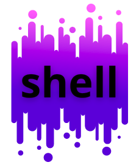

# shell
  Welcome! Want to write your own shell, but don't know where to start? Use my open source shell and add your own ideas. Perhaps you can find simpler algorithms for what is already described in my program. I look forward to any of your comments!
<cut />
 

### How to compile:

 - Download "sources" and Makefile.
 - Press the key combination Ctrl + Alt + T.
 - Use the **cd** command to go to the directory where these files are stored. Pass the path to the required directory as a parameter.
 - Use the **make** command to compile.
 - **./main** ... Yahoo! Shell is ready to go!
 
### How to use:
 First, let's look at the contents of the current directory. To do this, we will use the command **ls**.

